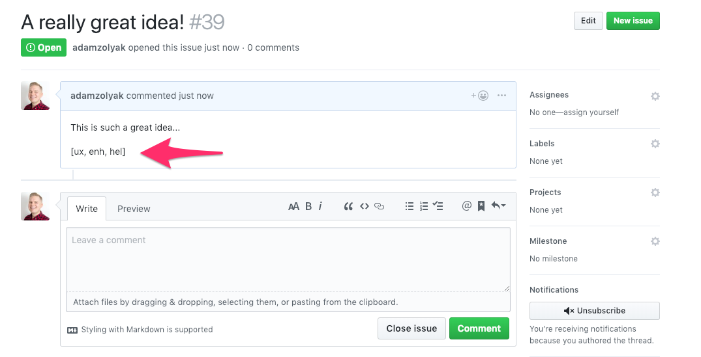
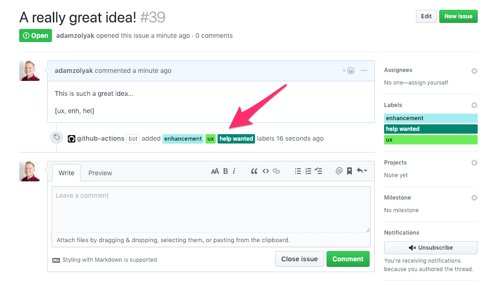

# 🏷 🏷 🏷 Bulk Labels - GitHub Action

A [GitHub Action](https://github.com/features/actions) to bulk add labels when creating a new issue 📝.

## How It Works

This GitHub Action runs when an [`issues` event webhook](https://developer.github.com/v3/activity/events/types/#issuesevent) is fired in your GitHub repo. The action checks if there is an array of bulk labels to add `[aaa, bbb, ccc]` in markdown in the issue's description. The action works with existing labels defined in your GitHub repo; the labeler expects the first 3 characters of the label name (ex. `hel` for a "help wanted" label). If there is 1 or > bulk labels, the action labels the issue with the specified label(s).

## Installation

To use this GitHub Action, you must have access to [GitHub Actions](https://github.com/features/actions). GitHub Actions are currently only available in private beta (you must [apply for access](https://github.com/features/actions)) and only work in private repos.

To setup this action:

1. Create a `.github/main.workflow` in your GitHub repo.
2. Add the following code to the `main.workflow` file and commit it to the repo's `master` branch.

```
workflow "Bulk Issue Labeler" {
  resolves = ["BulkLabel"]
  on = "issues"
}

action "BulkLabel" {
  uses = "waffleio/gh-actions/action-bulklabels@master"
  secrets = ["GITHUB_TOKEN"]
}
```

3. Whenever you create an issue, the action will run!

## Examples

Example of a new issue with an array of bulk labels in the issue's description:


Example of the issue after the bulk labels are added to the issue:


## Extending

See [extending](../README.md#extending) in main README.

### To run tests locally

1. run `npm install` to install dependencies
2. run `npm test` to run tests

### To run action locally

1. `npm install` to install dependencies
2. create a `dev` file with the following contents:

```bash
export GITHUB_TOKEN="12345"
export GITHUB_REPOSITORY="adamzolyak/actions-playground"
export GITHUB_EVENT_PATH="/action-checklistchecker/tests/fixtures/actionTrigger.json"

node index.js
```

3. modify contents of [/tests/fixtures/actionTrigger.json](./tests/fixtures/actionTrigger.json) as needed for test data
4. run `bash dev`
