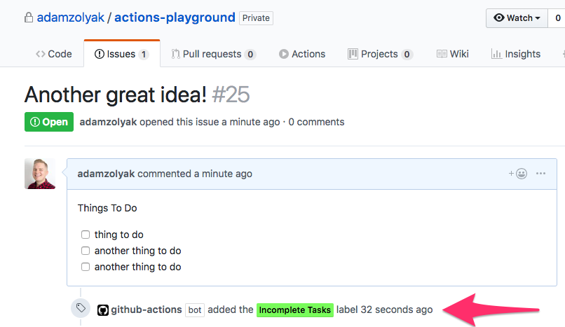
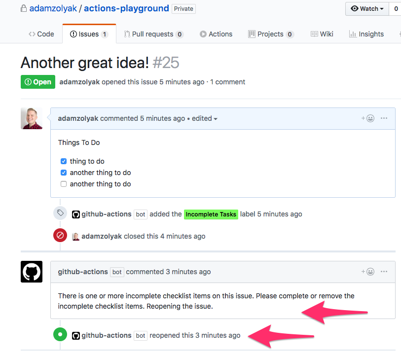

# 👩‍👧‍👦 Mirror Labels to Child - GitHub Action

A [GitHub Action](https://github.com/features/actions) that mirrors labels from a parent issue to it's children issues 👩‍👧‍👦. The action supports the [child keywords supported by Waffle.io](https://help.waffle.io/epics/which-keywords-are-supported-with-epics) - `child #<issue_number>`, `child to #<issue_number>`, `child of #<issue_number>`. The `child <owner>/<repo>#<issue_number>` syntax is also supported for cross repo relationships.

## How It Works

This GitHub Action runs when an [`issues` event webhook](https://developer.github.com/v3/activity/events/types/#issuesevent) is fired in your GitHub repo. The action checks if there is a [parent / child relationship](https://help.waffle.io/epics/which-keywords-are-supported-with-epics) between the issue and another issue. If so, the action mirrors labels from the parent issue to the child issue.

Notes:

- If a label is removed from a parent issue, the label is is not removed from the child issue.
- If a label is added to the parent issue, it will be applied to the child issue the next time the child is edited.
- If a child has multiple parents, only the lables from the child's first parent are mirrored to the child.

## Installation

To use this GitHub Action, you must have access to [GitHub Actions](https://github.com/features/actions). GitHub Actions are currently only available in private beta (you must [apply for access](https://github.com/features/actions)) and only work in private repos.

To setup this action:

1. Create a `.github/main.workflow` in your GitHub repo.
2. Add the following code to the `main.workflow` file and commit it to the repo's `master` branch.

```
workflow "Mirror Labels to Child Issue" {
  resolves = ["MirrorLabels"]
  on = "issues"
}

action "MirrorLabels" {
  uses = "waffleio/gh-actions/action-mirrorlabelstochild@master"
  secrets = ["GITHUB_TOKEN"]
}
```

3. Whenever you create, update, close, or reopen an issue, the action will run!

## Examples

Example of issue with incomplete checklist items in the description labeled with "Incomplete Tasks" label:


Example of re-opened issue with incomplete checklist items in the description labeled with "Incomplete Tasks" label:


## Extending

See [extending](../README.md#extending) in main README.

### To run tests locally

1. run `npm install` to install dependencies
2. run `npm test` to run tests

### To run action locally

1. `npm install` to install dependencies
2. create a `dev` file with the following contents:

```bash
export GITHUB_TOKEN="12345"
export GITHUB_REPOSITORY="adamzolyak/actions-playground"
export GITHUB_EVENT_PATH="/action-checklistchecker/tests/fixtures/actionTrigger.json"

node index.js
```

3. modify contents of [/tests/fixtures/actionTrigger.json](./tests/fixtures/actionTrigger.json) as needed for test data
4. run `bash dev` to run locally
