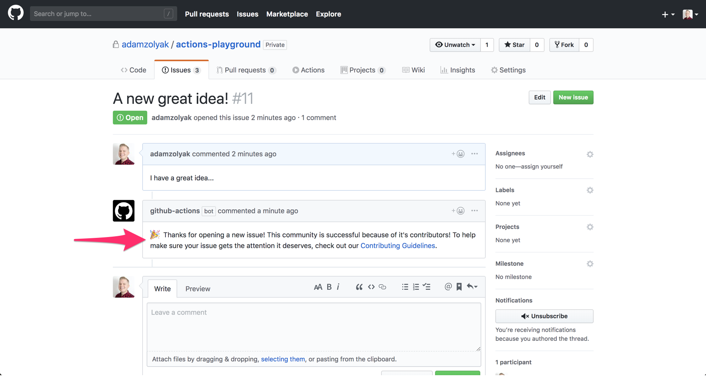
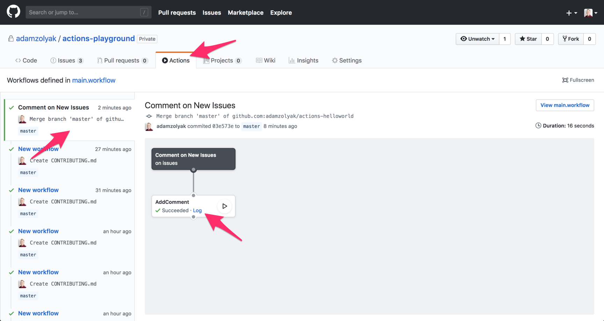
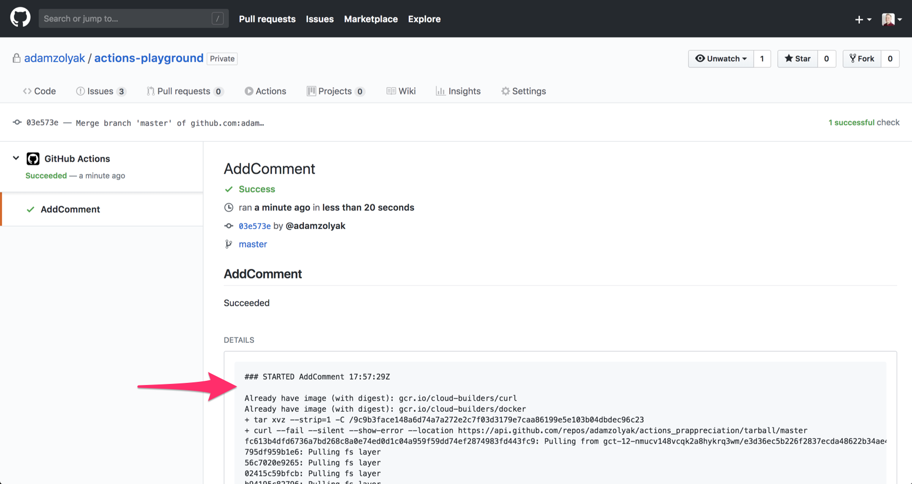

# 📣 New Issue Comment - GitHub Action

A basic [GitHub Action](https://github.com/features/actions) that demonstrates how to post a welcome comment when a new issue is created 📝🎉. 

This is a good demonstration of how to use [GitHub Actions](https://github.com/features/actions), [Octokit Node.js](https://github.com/octokit/rest.js), and the [GitHub API](https://developer.github.com/v3/) to customize your GitHub repository's workflow.  

Fork 🍴 this repo to use as a starting point to create your own GitHub Actions.  What will you automate in your workflow 🤖?

## How It Works

This GitHub Action runs when an [`issues` event webhook](https://developer.github.com/v3/activity/events/types/#issuesevent) is fired in your GitHub repo.  The action checks if the event is of type action = `opened` and posts a comment to the issue thanking the user for their contribution.  

## Installation

To use this GitHub Action, you must have access to [GitHub Actions](https://github.com/features/actions).  GitHub Actions are currently only available in private beta (you must [apply for access](https://github.com/features/actions)) and only work in private repos.

To setup this action:
1. Create a `.github/main.workflow` in your GitHub repo.
2. Add the following code to the `main.workflow` file and commit it to the repo's `master` branch.
```
workflow "Comment on New Issues" {
  resolves = ["AddComment"]
  on = "issues"
}

action "AddComment" {
  uses = "waffleio/gh-actions/action-newissuecomment@master"
  secrets = ["GITHUB_TOKEN"]
}
```
3. Create a new issue!  
4. Click on the Actions tab in your repo.  You should see a new action that was recently triggered when you created the new issue.  After a few seconds, there should be a comment on your issue.

### Debugging
If you've followed the steps above and it isn't working, trying the following:
* If you don't see an Actions tab in your repo, make sure your repo is private and make sure you've been accepted into the private beta.
* If you see the Actions tab but there isn't a comment on your new issue, click on the Log link on the action to view the log and check for errors.

## Extending

Fork 🍴 this repo to use as a starting point to create your own GitHub Actions.  What will you automate in your workflow 🛠🤖💪?

Some helpful resources:
* [GitHub Actions Docs](https://developer.github.com/actions/)
* [Octokit Rest.js Docs](https://octokit.github.io/rest.js/#api-Issues-createComment)
* [Dockerfile Docs](https://docs.docker.com/engine/reference/builder/)

## Examples

Example of this action running on a new issue:


Example of the Actions tab show this action running:


Example of the log details from this action running:

