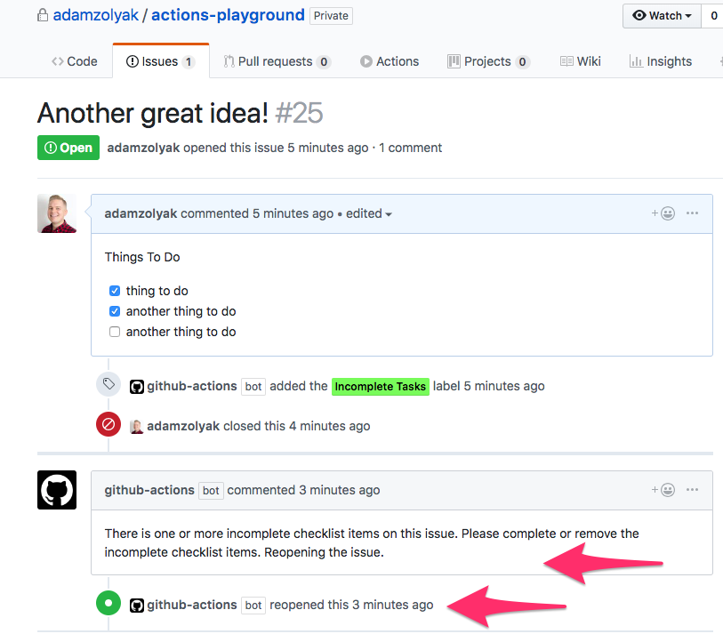

# 🚗 PR Closed Labeler - GitHub Action

A [GitHub Action](https://github.com/features/actions) that labels pull requests when they are closed as either merged or not merged 🚗 .

## How It Works

This GitHub Action runs when an [`pull_request` event webhook](https://developer.github.com/v3/activity/events/types/#issuesevent) is fired in your GitHub repo. The action checks if pull request was closed. If the pull request was closed and marged it applies the `prMergedLabel`. If the pull request was closed but not merged it applies the `prNotMergedLabel`. Note: if the pull request is closed but not merged and the branch is deleted before the action finishing running, the action run will be canceled.

## Installation

To use this GitHub Action, you must have access to [GitHub Actions](https://github.com/features/actions). GitHub Actions are currently only available in private beta (you must [apply for access](https://github.com/features/actions)) and only work in private repos.

To setup this action:

1. Create a `.github/main.workflow` in your GitHub repo.
2. Add the following code to the `main.workflow` file and commit it to the repo's `master` branch.

```
workflow "PR Closed Labeler" {
  resolves = ["PRClosedLabeler"]
  on = "pull_request"
}

action "PRClosedLabeler" {
  uses = "waffleio/gh-actions/action-prmergelabel@main"
  secrets = ["GITHUB_TOKEN"]
}
```

3. Whenever you close a pull request, the action will run!

## Examples

Example of issue with incomplete checklist items in the description labeled with "Incomplete Tasks" label:


Example of re-opened issue with incomplete checklist items in the description labeled with "Incomplete Tasks" label:


## Extending

See [extending](../README.md#extending) in main README.

### To run tests locally

1. run `npm install` to install dependencies
2. run `npm test` to run tests

### To run action locally

1. `npm install` to install dependencies
2. create a `dev` file with the following contents:

```bash
export GITHUB_TOKEN="12345"
export GITHUB_REPOSITORY="adamzolyak/actions-playground"
export GITHUB_EVENT_PATH="/action-checklistchecker/tests/fixtures/actionTrigger.json"

node index.js
```

3. modify contents of [/tests/fixtures/actionTrigger.json](./tests/fixtures/actionTrigger.json) as needed for test data
4. run `bash dev` to run locally
